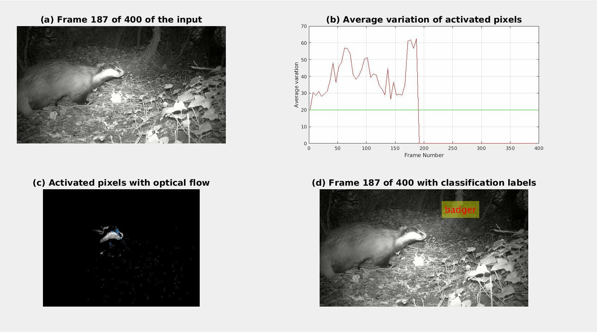

The following links direct to 5 different demo videos. 
  [Badger 1](https://youtu.be/u4Bp4VyX5bA) 
  [Badger 2](https://youtu.be/1uvLCCjuAlE)
  [Fox 1](https://youtu.be/Q4pnmVJwLCU)
  [Fox 2](https://youtu.be/zFn8KsnWr9Q)
  [Fox 3](https://youtu.be/HGgAdevcbB4)

In the above attached videos, you will see video frames like the following. 
  

  Subplot a: a input frame in a video.
  Subplot b: the average variation of the activated pixels in the current frame. A threshold is set to 20. A frame whose average variation above 20 is sent for classification. 
   Subplot c: the cleared version of the activated pixels, with optical flow indicating of the motion estimations. 
   Subplot d: if a frame is activated, it will be classified by the trained CNN framework, the classification result will be printed on the top right corner. 

